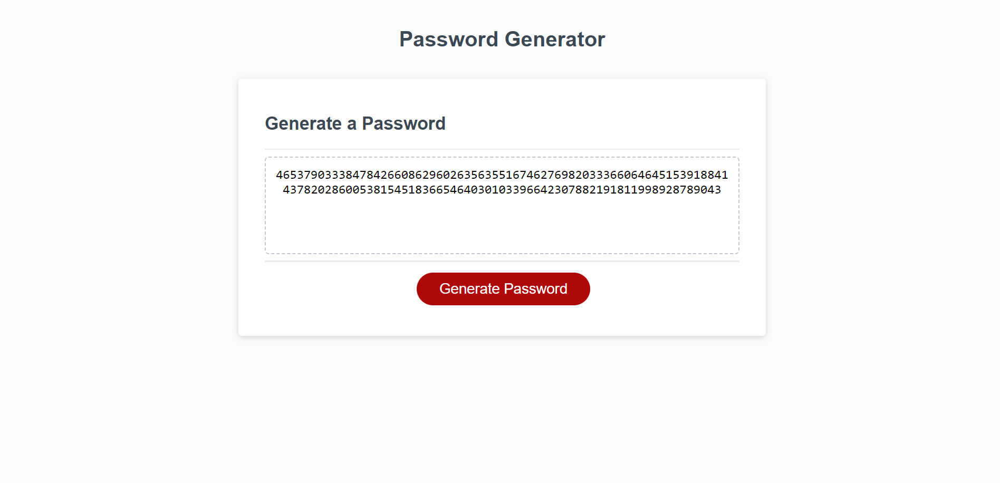

# Password Creator Challenge

## Description

This password creator challenge gives the user an opportunity to create a password based on the criteria they choose. This challenge incorporated the skills in JavaScript that we have been working on such as arrays and functions. 

## Installation 

N/A

## Usage

You want to click on the generate password button to bring up the window prompts. From there, you will be asked how many charcters you want your password to be. After that, you will be asked if you want to include lowercase letters, uppercase letters, numbers, and symbols in your password. If you select ok on the prompts, they will be used in your password. 

After you go through the prompts and select the criteria, you will be presented with a password in the box which you can copy. Please see the screenshot for a password with 128 characters that only used numbers. 

## Credits 

N/A

## License 

N/A